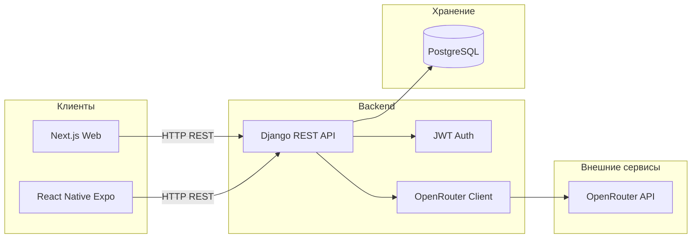
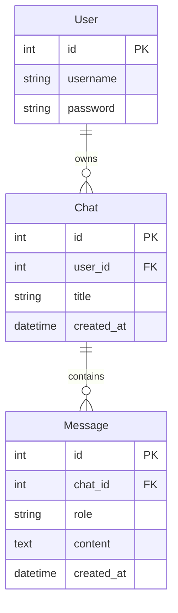

# Neural Chat — SaaS-чат с искусственным интеллектом

Веб- и мобильное приложение в стиле ChatGPT: регистрация, авторизация, диалоги с AI, сохранение истории переписки в базе данных.

---

## Описание проекта

**Neural Chat** — учебный fullstack-проект, демонстрирующий построение клиент–серверного приложения с интеграцией больших языковых моделей (LLM) через внешний API.

Пользователь создаёт аккаунт, ведёт несколько чатов, выбирает модель AI и получает ответы с анимацией «печати». Все сообщения сохраняются в PostgreSQL и доступны после перезагрузки страницы или повторного входа в приложение.

---

## Архитектура



---

## Использованные технологии (для защиты)

### Backend

| Технология | Назначение в проекте |
|------------|----------------------|
| **Python 3** | Язык серверной части |
| **Django 6** | Web-фреймворк, ORM, админ-панель |
| **Django REST Framework** | REST API, сериализация, декораторы `@api_view` |
| **djangorestframework-simplejwt** | JWT-аутентификация (вход, токены access/refresh) |
| **PostgreSQL** | Реляционная БД: пользователи, чаты, сообщения |
| **psycopg2** | Драйвер подключения Django ↔ PostgreSQL |
| **python-dotenv** | Загрузка секретов из `.env` |
| **django-cors-headers** | CORS для запросов с фронтенда и мобильного приложения |
| **requests** | HTTP-запросы к OpenRouter API |
| **OpenRouter API** | Доступ к LLM (GPT-OSS, Nemotron, DeepSeek и др.) |

### Frontend (Web)

| Технология | Назначение в проекте |
|------------|----------------------|
| **Next.js 16** | React-фреймворк, App Router, SSR/клиентские компоненты |
| **React 19** | UI-компоненты, состояние, хуки |
| **TypeScript** | Типизация кода |
| **Tailwind CSS 4** | Стилизация интерфейса |
| **Fetch API** | Запросы к Django REST API |

### Mobile

| Технология | Назначение в проекте |
|------------|----------------------|
| **React Native** | Кроссплатформенное мобильное UI |
| **Expo SDK 54** | Сборка и запуск через Expo Go |
| **Expo Router** | Файловая навигация (экраны login, chat) |
| **AsyncStorage** | Локальное хранение JWT-токена |
| **expo-linear-gradient** | Градиенты на экране авторизации |

### Инфраструктура и инструменты

| Технология | Назначение |
|------------|------------|
| **Git** | Контроль версий |
| **npm** | Менеджер пакетов (frontend, mobile) |
| **pip / venv** | Окружение Python |

---

## Функциональные возможности

- Регистрация и вход пользователя (JWT)
- Создание нескольких чатов на одного пользователя
- Отправка сообщений и получение ответа от AI
- Выбор модели нейросети из списка
- Автоматический fallback на другую модель при ошибке API
- Сохранение полной истории диалога в БД
- Анимация «AI думает» и посимвольная печать ответа (web)
- Адаптивный интерфейс и мобильное приложение (Expo Go)
- Проверка доступности сервера (`/api/health/`)

---

## Структура репозитория

```
ai-chat-saas/
├── backend/           # Настройки Django (settings, urls)
├── chat/              # Приложение: models, views, AI, миграции
├── frontend/          # Next.js веб-клиент
├── mobile/            # React Native (Expo) клиент
├── manage.py
├── requirements.txt
├── .env.example
└── README.md
```

---

## Модель данных



- **User** — стандартная модель Django `auth.User`
- **Chat** — диалог пользователя
- **Message** — сообщения с ролями `user` / `assistant`

---

## REST API

| Метод | Endpoint | Описание | Авторизация |
|-------|----------|----------|-------------|
| GET | `/api/health/` | Проверка сервера | Нет |
| GET | `/api/models/` | Список AI-моделей | Нет |
| POST | `/api/chat/register/` | Регистрация | Нет |
| POST | `/api/auth/login/` | Вход (JWT) | Нет |
| POST | `/api/auth/refresh/` | Обновление токена | Нет |
| GET | `/api/chats/` | Список чатов | Bearer JWT |
| POST | `/api/chat/create/` | Новый чат | Bearer JWT |
| POST | `/api/chat/message/` | Отправить сообщение | Bearer JWT |
| GET | `/api/chat/<id>/` | История чата | Bearer JWT |

---

## Установка и запуск

### Требования

- Python 3.11+
- Node.js 20+
- PostgreSQL
- Ключ [OpenRouter](https://openrouter.ai/keys)

### 1. Backend

```bash
# Клонировать репозиторий
git clone <url-репозитория>
cd ai-chat-saas

# Виртуальное окружение
python -m venv venv
venv\Scripts\activate        # Windows
# source venv/bin/activate   # Linux / macOS

pip install -r requirements.txt

# Настроить .env (скопировать из .env.example)
copy .env.example .env

# Создать БД в PostgreSQL: ai_chat

python manage.py migrate
python manage.py runserver 0.0.0.0:8000
```

### 2. Web (Next.js)

```bash
cd frontend
npm install
npm run dev
```

Открыть: http://localhost:3000

### 3. Mobile (Expo Go)

```bash
cd mobile
npm install
# Создать mobile/.env с IP вашего ПК:
# EXPO_PUBLIC_API_URL=http://192.168.x.x:8000/api

npx expo start -c
```

Подробнее: [mobile/README.md](mobile/README.md)

---

## Переменные окружения

Файл `.env` в корне проекта:

```env
OPENROUTER_API_KEY=sk-or-v1-...
DB_NAME=ai_chat
DB_USER=postgres
DB_PASSWORD=...
DB_HOST=localhost
DB_PORT=5432
```

Для мобильного клиента — `mobile/.env`:

```env
EXPO_PUBLIC_API_URL=http://<IP-ПК>:8000/api
```

---

## Безопасность

- Пароли хранятся в виде хэша (Django `create_user`)
- API защищён JWT (кроме регистрации и health)
- Чаты привязаны к пользователю — нельзя читать чужие диалоги
- Секреты вынесены в `.env` (не коммитятся в Git)
- CORS настроен для разработки

---

## Возможные направления развития

- Деплой на VPS (Docker, Nginx, Gunicorn)
- Потоковая передача ответа (SSE / WebSocket)
- Оплата подписки (Stripe)
- Регенерация и редактирование сообщений
- Загрузка файлов в контекст чата

---

## Автор


---

## Лицензия

Учебный проект. Использование — в образовательных целях.


